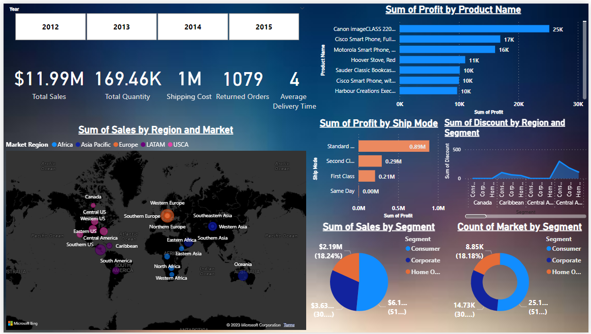

# Microsoft Power BI Dashboard

The dashboard gives a summary about the sales data from a retail store. 

There are 3 tables:
- Products: This table contains information about the products sold.
- Customers: This table contains information about the customers who bought the products.
- Sales: This table contains information about the sales transactions.

## Dashboard:

## Tasks done:

- [X] Connect the Database.
- [X] Analyzing the tables and relations.
- [X] Cleaning the data using Power Query Editor and DAX (Data Analysis Expressions).
- [X] Developing an interactive BI dashboard/report.
